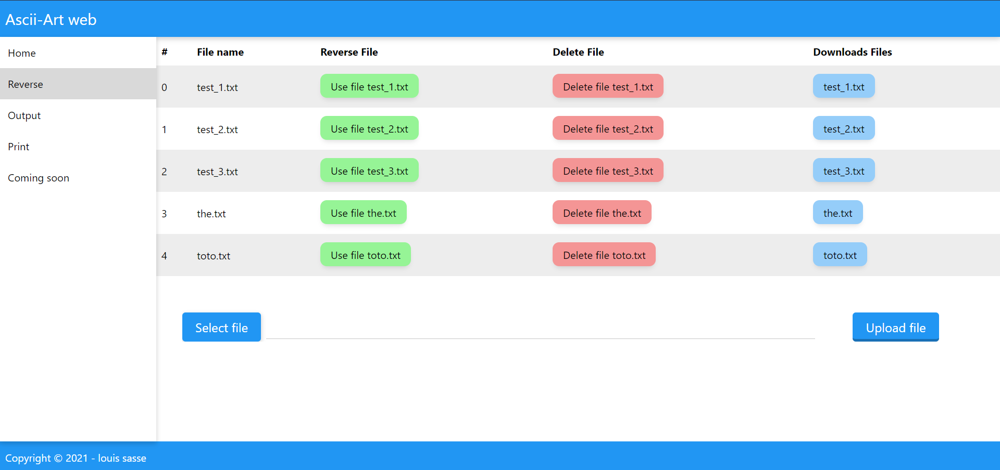
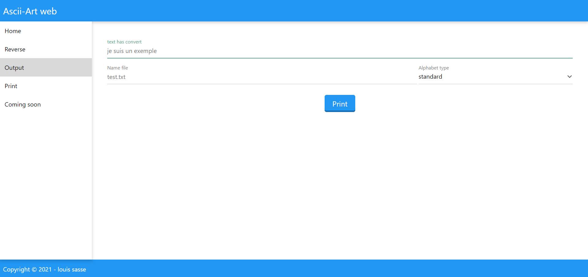
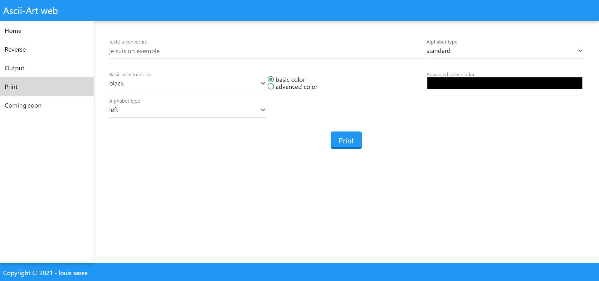

# **Ascii-art-wab**
before run the server edit file config.yml to make the settings of the server for adapt the server on your machine.
````
server:
  host: "localhost"
  port: 80
  path:
    pathServer: "C:/Users/louis/IdeaProjects/ascii-art-web/"
    pathOutputFile: "Controller/ascii-art/output/"
  log:
    path: "Controller/log/"
    fileName: "log.log"
    
link:
  home:
    urlHome: "/"
    pathHomeHtml: "Controller/assets/html/index.html"
  print:
    urlPrint: "/print"
    pathPrintHtml: "Controller/assets/html/print.html"
  output:
    urlOutput: "/output"
    pathOutputHtml: "Controller/assets/html/output.html"
  reverse:
    urlReverse: "/reverse"
    pathReverseHtml: "Controller/assets/html/reverse.html"
  downloadsFiles:
    urlDownloadsFiles: "/download/output/"
    pathDownloadsFiles: "Controller/ascii-art/output"
  loadsAssets:
    urlLoadsAssets: "/load-assets/"
    pathLoadsAssets: "./Controller/assets"
````
````pathServer```` is not necessary but if don't want use replace ````pathServer: "folder of the server"```` by ````pathServer: ""````
for run the server execute this command ````go run main.go```` in the folder 
````ascii-art-web````
if the server does not want to work, check the log file, it will give you the reasons why the server does not start
for work my server use my library [**ascii-art**](https://github.com/minidiams/go.ascii-art)
with a small modification for a get the result of the ascii-art

for run with docker execut this command ````docker build -t my-go-app .```` and for run the docker ````docker run -it -p 8080:8080 my-go-app````
# result :
### **Reverse Page**

### **Output Page**

### **Print Page**

